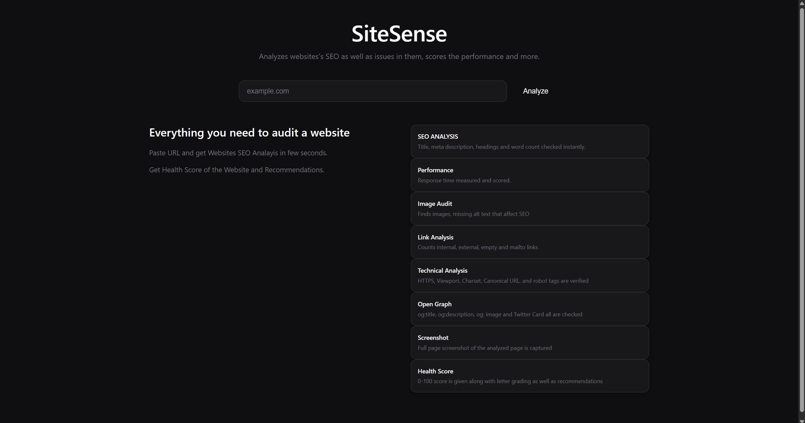
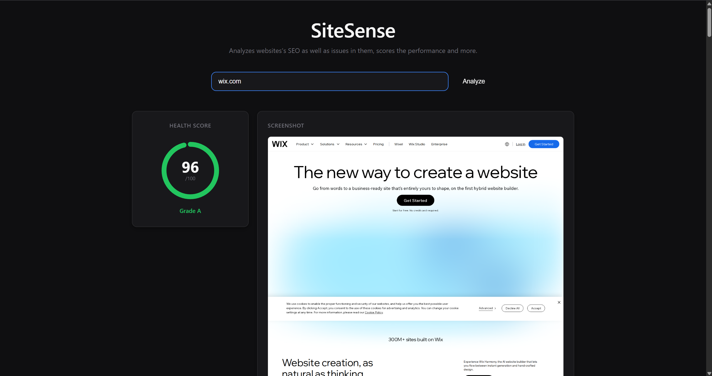
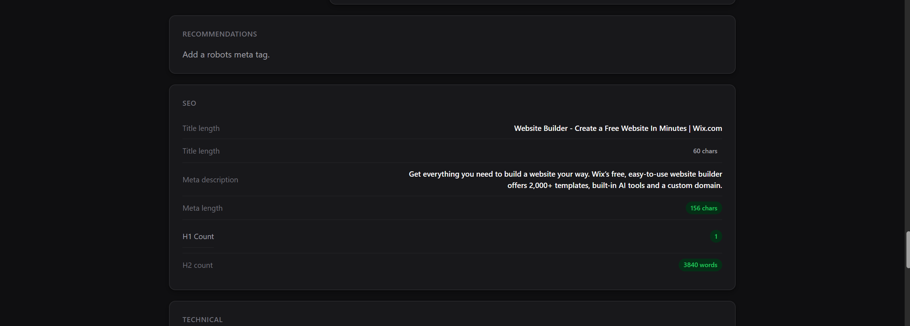

# SiteSense
SiteSense is a website auditing app which allows users to analyze the faulty aspects of their website. It analyzes the website overall SEO by checking the tags, images, headers, footers, paragraphs, wordcounts, strucuture, overall links and more which leads conclude with the overall Health Score of the site along with the letter grading as well as the recommendations for the website's better performance.It also provides with a full page screenshot of the analyzed website which lets user to exactly know where the analysis was done.



# Motivation:

While building websites, I always try to make website visible to public and that stands out. So I stumbled upon the term SEO and dived deep into it. While I was researching about SEO and was trying to build my website that outperforms other website, I couldnt figure out what was going wrong and what pulled my website back, to be specific I wasnt getting the exact thing which made my website's SEO rating down. So I started searching for apps and websites that fixes my issues but couldnt find the one that was convinient, easy to use and everything at one place, either they were too complex to solve my probelm or too many adds were run by them and some even required login, signup and record fillups, which was completely unnecessary. So I started making this project which also ended me up with knowing broswer automation, api development and enhanced my fullstack website development skills.



## Folder Structure

```text
SiteSense/
├── backend/
│   ├── auditor/
│   │   ├── __init__.py
│   │   ├── analyzer.py
│   │   ├── images.py
│   │   ├── links.py
│   │   ├── opengraph.py
│   │   ├── renderer.py
│   │   ├── scorer.py
│   │   ├── seo.py
│   │   └── technical.py
│   ├── screenshots/
│   ├── tests/
│   ├── app.py
│   ├── schemas.py
│   └── requirements.txt
│
├── frontend/
│   ├── public/
│   ├── src/
│   │   ├── api/
│   │   │   └── api.js
│   │   ├── components/
│   │   │   ├── AnalyzeForm.jsx
│   │   │   ├── ImagesCard.jsx
│   │   │   ├── LinksCard.jsx
│   │   │   ├── OpenGraphCard.jsx
│   │   │   ├── RecommendationList.jsx
│   │   │   ├── ScoreCard.jsx
│   │   │   ├── ScreenshotCard.jsx
│   │   │   ├── SEOCard.jsx
│   │   │   ├── TechnicalCard.jsx
│   │   │   └── Toast.jsx
│   │   ├── App.jsx
│   │   ├── App.css
│   │   ├── main.jsx
│   │   └── index.css
│   ├── package.json
│   └── vite.config.js
│
├── .gitignore
├── LICENSE
└── README.md
```


## Tech Stack:
- Backend: Python, FastAPI, Playwright, BeautifulSoup4
- Frontend: React, Axios, CSS3(For Styles)
- Testing: Python(pytest)
- Deployment: Vercel(Frontend), Nest(Backend)



# Why Playwright?:
- As playwright renders website in a real browser so it makes it possible to analyse the websites which are loaded with tons of Javascript more accurately along with that it also captures the full page screenshot of the website which makes this project stand out from pre existing SEO analysis tools.


# AI USE:
- I used Claude for the generation of the project structure( directory strcuture ) and for learning purpose of libraries like: BeautifulSoup4, Playwright which I learnt along with implentation which made my learning process even effective.